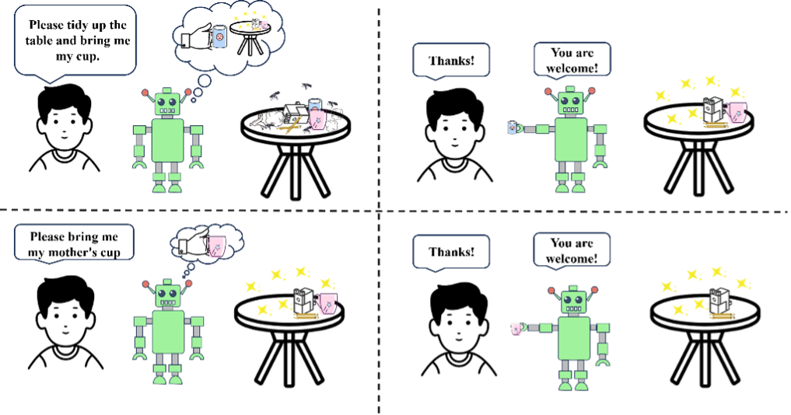
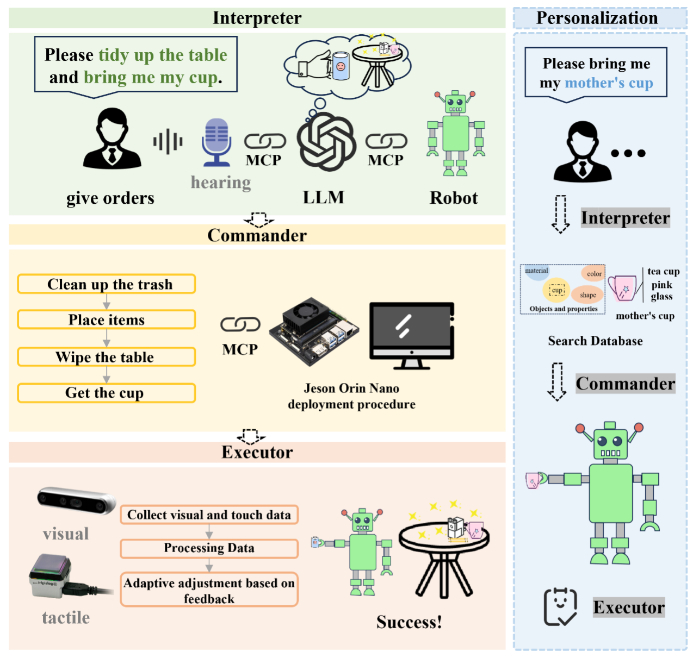
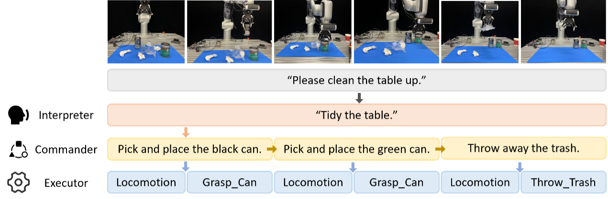
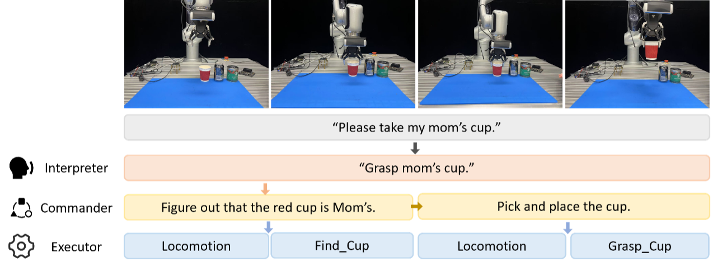

# 思而后行
基于视触听觉多模态的服务机器人

Developed by [@Fenbid0605](https://github.com/Fenbid0605) and [@0xJacky](https://github.com/0xJacky)

## 项目概述 
### 引言
尽管近年来家庭服务机器人的技术不断进步，但多数系统依然依赖预设脚本或固定指令执行，缺乏对人类语言、意图乃至偏好的真实理解。换句话说，现有机器人更像是“机械执行者”，而非能自主适应复杂家庭场景的“智能帮手”。要让机器人真正融入人类生活，其核心能力不应仅限于感知和动作执行，更应包括对人类语言的语义理解、对任务的自主思考，以及对使用者行为的持续学习。本研究提出一种多模态层级智能体系统，以构建具备理解、思考与学习能力的家庭机器人为目标，如图1所示。该系统整合语音、视觉、触觉三路感知信号，基于 Interpreter–Commander–Executor 三层架构，将自然语言指令转化为具体可执行的动作流程，并通过边缘设备 Jetson Orin Nano 实现低时延本地推理。与传统机器人不同，我们的系统不仅能完成简单抓取任务，还能动态拆解多步骤操作，并在用户偏好建模的基础上，实现更具个性化的家庭服务。
 

图1.任务示例

### 系统框架
如图2所示，本系统采用 Interpreter–Commander–Executor 三层模块化架构，以实现从自然语言指令到底层执行控制的全流程闭环。
Interpreter ：负责将用户语音转写为文本，并通过调用大语言模型对语义进行结构化解析，提取任务目标与关键参数。
Commander ：在此基础上进一步调用大语言模型，完成动作序列的生成与任务依赖结构的构建，形成清晰的执行图（DAG）。
Executor ：部署于边缘计算平台 Jetson Orin Nano，通过轻量级 MCP 协议将高层任务映射为机械臂、夹爪及多模态传感器的具体控制指令，同时基于 ROS 2 实现低延迟的实时反馈与动态调节，构建起“自上而下的任务指令链”与“自下而上的感知反馈流”的闭环系统。
该层级式架构使机器人在任务响应过程中具备良好的可扩展性、实时性与任务通用性，为多模态交互与个性化服务提供了系统级支撑。
 

图2.系统总体框架

### 多模态硬件集成
听觉：科大讯飞语音模块

视觉：Intel Realsense D437相机

触觉：Gelsight Mini触觉传感器

边缘计算：Jetson Orin Nano

## 系统功能与亮点
### 单任务执行：抓取一个杯子
当用户发出“请抓取一个杯子”的语音指令时，系统首先由 Interpreter 层将其解析为结构化语义意图：“动作类型 = 抓取；目标物体 = 杯子”。基于该意图，Commander 层生成三步动作序列：定位杯子 → 规划抓取位姿 → 控制夹爪闭合。Executor 层则利用 Intel RealSense D437 相机获取 RGB-D 图像，结合 Gelsight Mini 触觉传感器提供的实时反馈对抓取力度进行微调，并由七自由度机械臂与 Robotiq 夹爪协同完成操作。该过程在边缘计算设备 Jetson Orin Nano 上完成全流程本地推理，整体响应时延控制在百毫秒量级，确保抓取过程的实时性与稳定性。

### 多任务拆解执行：整理桌面上的所有杯子
针对“把桌子上的杯子都整理好”这一复合命令，系统需支持任务的自动拆解与动态调度。Commander 层基于首次调用的大语言模型输出，将自然语言意图分解为多目标检测 → 逐一抓取 → 依次放置等基本动作单元，并构建包含依赖关系的有向无环图（DAG）。在执行过程中，系统复用单杯抓取的控制流程，并通过状态机模块动态记录已完成与待执行的物体列表，从而在每个循环中精确调用相应动作，确保整体流程高效、无遗漏、且避免潜在的机械臂路径冲突，具体流程示例见图3。
 

图3.多任务场景示例：清理桌面任务的分解与执行

### 个性化偏好建模：拿起我妈妈的杯子
面对“拿起我妈妈的杯子”这类带有主观偏好的指令，系统需在语义理解基础上实现语义-感知对齐与个体化推理。首先，在实体消歧模块中，系统将“妈妈”映射为特定用户身份，再结合视觉识别结果中提取的颜色、形状等属性定位至唯一标识为 cup_0032 的物体。与此同时，系统通过查询基于 Neo4j 图数据库构建的用户偏好知识图谱，确认该杯子与当前家庭成员之间的关联关系，并据此调整目标优先级。最终，Executor 层完成指定物体的抓取操作。全过程引入 TensorFlow Federated 框架，在 Jetson Orin Nano 上进行本地增量学习，仅上传加密的模型更新梯度，实现个性化策略的持续优化，同时兼顾用户隐私保护。具体流程示例见图4。
 

图4.偏好驱动场景示例：识别并抓取妈妈的杯子

## MCP服务-客户端设计
系统以轻量级 MCP为骨干，在 Jetson Orin Nano 上同时运行服务端与客户端。服务端负责统一注册设备、接收 Interpreter 的任务意图，并把解析后的动作流路由给客户端；客户端作为 ROS2 节点调用机械臂、Robotiq Gripper、Intel Realsense D437 摄像头和 Gelsight Mini 触觉传感器的驱动，实时执行并把传感器数据回传。

## Agentic AI平台落地
在平台内将系统拆分为三个 Agent：
1. Interpreter Agent 解析语音文本并输出结构化意图；
2. Commander Agent结合多模态感知和用户偏好制定步骤计划；
3. Executor Agent 通过设备工具包驱动机械臂执行。

三者以平台提供的 Action Graph 串联，可视化编排且日志完整；用户偏好写入 Memory，让机器人随交互自学习。

## UI设计与优化
1. 可视化Action Graph展示任务拆解与执行进度，支持节点级回溯
2. 语义查询面板允许检索并人工校正“偏好-物品”映射
3. 首页实时显示任务队列和执行状态，提供一键终止或重排操作，保障可控与安全。

## 关键技术与创新点
1. 多模态输入融合
系统结合了三种感知信息：使用Realsense D437 相机获取视觉数据，识别物体颜色、位置和形状；使用触觉传感器获取接触面信息与抓取反馈；使用远场麦克风环形阵列ROS六麦语音模块获取用户语音输入。三种感知协同配合，使系统在面对不同场景时具备更全面的环境理解与动作调节能力。
2. 支持个性化语义偏好的理解与响应
项目聚焦于“个性化家务指令”的处理能力，系统可以识别指令中模糊表达与主观偏好（如“拿我最常用的杯子”、“妈妈喜欢的那个”、“把书放回原来的位置”、“拿左边的那个勺子”、“用新的碗，不要用旧的”），并结合场景感知做出合理判断，体现了语义到动作之间的灵活映射能力。
3. MCP协议贯通语义-控制
使用MCP协议 把 Interpreter→Commander→Executor 信号封装成统一消息：Intent → Control → Feedback，在 Jetson 内部快速闭环，上层只关心意图，下层设备按字段执行，减少接口改动，更易于维护。
4. 基于Nvidia Jetson Orin Nano的边缘部署
所有模块均部署于 Jetson 平台上运行，涵盖语义处理、感知识别与运动控制，支持本地化处理与闭环反馈，降低通信延迟，提升系统稳定性，适合实际家庭场景中的部署使用。
5. NVIDIA SDK使用
JetPack 6 集成 CUDA/cuDNN/TensorRT，在 Jetson Orin Nano 上实现 LLM 量化推理与目标检测
核心模型导出 ONNX 后用 ONNX Runtime 统一推理，便于在开发机与 Jetson 间无缝迁移。VS Code Remote-SSH 支持 ROS2 远程调试；可选 Azure IoT Hub 进行 OTA 更新与日志汇总，离线场景下自动回落本地运行。Power BI 嵌入式仪表盘将 MCP 日志与抓取指标可视化，方便运维与展示。

## 贡献
1. 在家务机器人场景验证了三层多模态智能体+偏好注入架构，形成端到端闭环。
2. 构建同意MCP消息通道，减少硬件异构导致的接口碎片化。
3. 实现完整的边缘部署方案，为无网络家庭提供可落地模板。

## 未来展望
未来，我们计划从两个维度进一步拓展系统能力：一方面，在应用场景层面，我们希望将本系统从家务服务场景迁移至更广泛的实际应用中，包括养老陪护中的辅助取物与交互、医院内的智能物品传递，以及餐饮配送与自动配餐等半结构环境。这一跨场景迁移能力将依托于系统通用的感知-理解-执行闭环架构与持续学习能力，为服务型机器人提供更高的适应性与通用性。另一方面，在交互机制层面，我们将进一步提升任务处理的复杂度，引入多轮对话机制以支持连续、上下文相关的人机交互，使系统能够理解更长跨度的语义链条，并在对话过程中动态调整任务执行策略。此外，我们还计划优化大模型推理与边缘增量学习的资源调度与量化压缩策略，以提升 Jetson Orin Nano 在多任务、多模态情境下的实时推理效率。通过上述拓展，我们致力于推动家庭服务机器人从“响应式工具”向“理解型助手”的进化，迈向真正具备“自主意识”的智能体未来。
